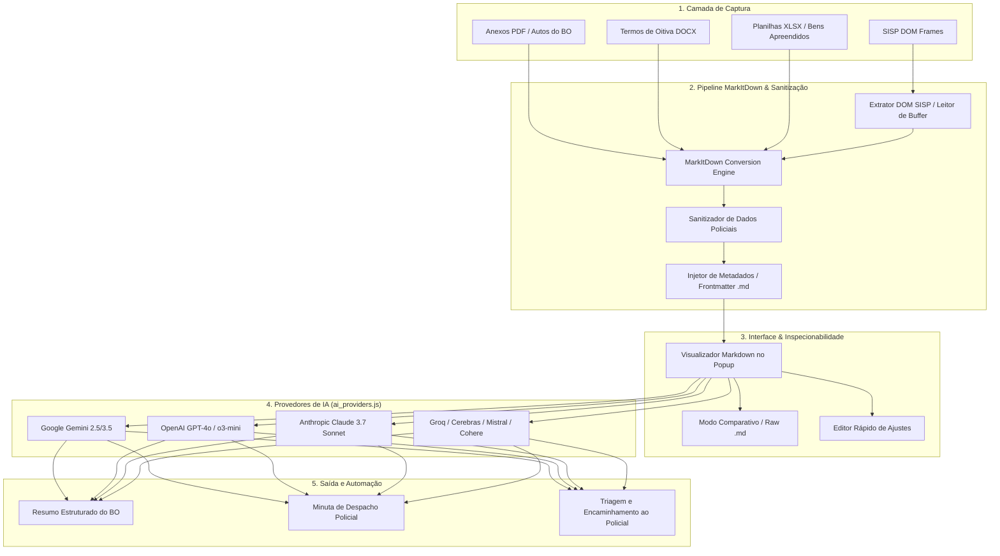
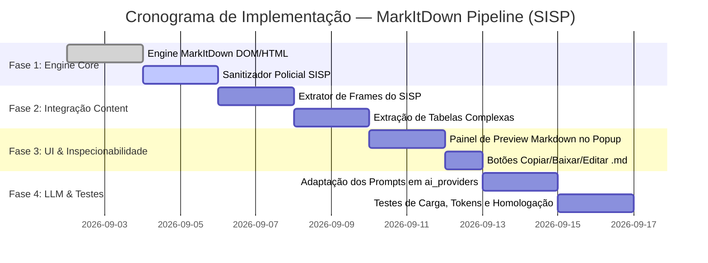

# PRD — Pré-processamento e Conversão de Documentos com MarkItDown para Análise por IA

**Documento de Requisitos de Produto (Product Requirements Document)**  
**Projeto:** SISP • Despacho IA  
**Versão:** 1.0  
**Status:** Aprovado para Desenvolvimento  
**Data:** 01 de Setembro de 2026  
**Autor:** Equipe de Engenharia e Produto  

---

## 1. Visão Geral e Objetivos do Produto

### 1.1 Contexto do Problema
A extensão **Despacho IA** automatiza a leitura e análise de Boletins de Ocorrência (BOs) e procedimentos policiais no sistema **SISP** (Secretaria de Segurança Pública / Polícia Civil), elaborando automaticamente minutas de despachos, resumos analíticos e triagem de policiais destinatários através de modelos de linguagem avançados (Gemini, GPT-4o, Claude 3.7, Groq Llama 3.3, Mistral, Cohere, Cerebras).

Atualmente, o processo de extração textual captura o conteúdo por meio de `document.body.innerText` ou concatenação bruta dos frames do SISP. Esta abordagem apresenta limitações relevantes:
1. **Perda de Relações Estruturais:** Tabelas de bens apreendidos, veículos, dados cadastrais de autores/vítimas e rol de testemunhas perdem o alinhamento de colunas e linhas ao serem lidas como texto plano corrido.
2. **Poluição de Tokens e Custo:** Elementos residuais de layout do portal SISP, quebras de linhas redundantes e botões de interface inflam desnecessariamente o volume de tokens enviados ao LLM (gerando um aumento de 40% a 70% na contagem de tokens).
3. **Alucinações e Menor Precisão na Análise Policial:** LLMs compreendem hierarquias sintáticas com muito mais fidelidade quando estruturadas com cabeçalhos (`#`, `##`), listas organizadas e tabelas canônicas.
4. **Tratamento de Documentos e Anexos Policiais:** Termos de declaração em DOCX, autos complementares em PDF ou planilhas de apreensões demandam um pipeline unificado de estruturação.

### 1.2 A Solução: MarkItDown Pipeline
Integrar a tecnologia de conversão **MarkItDown** (inspirada na biblioteca de alta fidelidade estrutural da Microsoft) para transformar as entradas do SISP (HTML de frames DOM, tabelas do portal, termos e relatórios) em um documento **Markdown (`.md`) canônico, limpo e estruturado** antes de sua injeção nos prompts dos LLMs.

### 1.3 Objetivos Principais
1. **Redução de Tokens em 40% a 65%:** Eliminar ruídos visuais, códigos de formatação desnecessários e espaços redundantes das páginas do SISP.
2. **Preservação Semântica Total de Tabelas e Seções:** Estruturar envolvidos, bens, tipificações penais e histórico em blocos Markdown perfeitamente legíveis para IA.
3. **Padronização Universal de Entrada (`.md`):** Garantir que qualquer provedor (Gemini, Claude, GPT, Groq, Mistral, etc.) receba a mesma representação de alta densidade semântica.
4. **Suporte a Documentos Multiformato do BO:** Habilitar conversão de HTML de tela do SISP, autos em PDF e anexos DOCX/XLSX.
5. **Transparência e Inspecionabilidade:** Permitir ao policial/operador visualizar e inspecionar o Markdown gerado antes do envio ao LLM via aba dedicada no painel da extensão.

---

## 2. Diagrama de Arquitetura e Fluxo de Dados



---

## 3. Especificação do Formato Markdown Padronizado (`.md`)

O documento final gerado a partir do SISP seguirá a seguinte taxonomia padronizada:

```markdown
---
sistema: "SISP"
tipo_documento: "Boletim de Ocorrência"
numero_bo: "001234/2026"
unidade_origem: "1ª Delegacia de Polícia da Capital"
data_fato: "2026-08-28 14:30:00"
timestamp_conversao: "2026-09-01T21:30:00Z"
conversor: "MarkItDown-Despacho-v1"
---

# BOLETIM DE OCORRÊNCIA Nº 001234/2026

## 1. DADOS GERAIS DO REGISTRO
- **Órgão:** Polícia Civil de Santa Catarina (PCSC)
- **Delegacia:** 1ª DP da Capital
- **Natureza Principal:** Estelionato (Art. 171, caput, do CP)
- **Local do Fato:** Rua das Flores, 120, Centro, Florianópolis/SC
- **Data e Hora da Comunicação:** 28/08/2026 às 16:45

## 2. PARTES ENVOLVIDAS
| Papel | Nome Completo | CPF / RG | Contato / Telefone | Representação / Manifestação |
| :--- | :--- | :--- | :--- | :--- |
| **Vítima** | Maria da Silva | 123.456.789-00 | (48) 99999-1111 | Deseja representar criminalmente |
| **Autor/Investigado** | João dos Santos | Desconhecido | PIX: chave@banco.com | Não localizado |

## 3. OBJETOS, VALORES E TRANSAÇÕES
| Categoria | Descrição do Bem / Transação | Identificador / Chave | Valor Estimado |
| :--- | :--- | :--- | :--- |
| Financeiro | Transferência Bancária via PIX | E2E00129381928391283 | R$ 3.500,00 |
| Documental | Comprovante de Pagamento em Anexo | comprovante_pix.pdf | - |

## 4. HISTÓRICO / RELATO DOS FATOS
A comunicante relata que no dia 28/08/2026 recebeu mensagem via aplicativo WhatsApp de perfil se passando por seu filho, solicitando transferência urgente via PIX no valor de R$ 3.500,00 para a conta de titularidade de João dos Santos. Após efetuar a operação, constatou tratar-se do golpe do falso parente. Junta comprovante de transferência e capturas de tela das conversas.

## 5. HISTÓRICO DE DESPACHOS E ANDAMENTOS ANTERIORES
- **28/08/2026 17:00** — *Cartório da 1ª DP:* Recebido e aguardando triagem da Autoridade Policial.
```

---

## 4. Requisitos Funcionais (RF)

### RF01 — Motor de Conversão MarkItDown para o Navegador (`src/markitdown_engine.js`)
- Criar motor autônomo e de alta performance de conversão DOM/HTML/Buffer para Markdown no contexto da extensão.
- **Regras de Conversão Semântica:**
  - Elementos estruturais `<h1>` a `<h6>` mapeados para `#` a `######`.
  - Tabelas HTML complexas do SISP (`<table>`, `<thead>`, `<tbody>`, `<tr>`, `<td>`, `<th>`) convertidas em tabelas Markdown alinhadas (`| Coluna 1 | Coluna 2 |`, `| :--- | :--- |`).
  - Listas ordenadas e não ordenadas (`<ul>`, `<ol>`, `<li>`) normalizadas com marcadores `-` e `1.`.
  - Tratamento de nós de texto de formulários do SISP (`<mat-expansion-panel>`, inputs, `<select>`, labels de pares chave-valor) transformados em listas de definição `- **Chave:** Valor`.
  - Remoção inteligente de ruídos: tags `<script>`, `<style>`, `<noscript>`, `<svg>`, botões de ação (`<button>`, `mat-icon`), menus laterais e barras de navegação do portal SISP.

### RF02 — Suporte a Documentos Anexos ao BO (PDFs, DOCX, Imagens/OCR)
- **Processamento de PDFs de Boletins e Laudos:**
  - Extração com preservação de fluxo de leitura (layout parsing) convertendo páginas em seções Markdown `### Página X`.
- **Processamento de Termos em DOCX:**
  - Extração de parágrafos, qualificações, negritos e tabelas sem formatação XML proprietária.
- **Processamento de Imagens e Comprovantes Escaneados (Opcional/Configurável):**
  - Integração com modelos multimodais de visão (Gemini 2.5 Flash / GPT-4o) para transcrição tabular de prints e recibos de golpes.
- **API Unificada de Conversão:**
  ```javascript
  const mdResult = await MarkItDown.convert({
    source: domElement | rawHtmlString | fileBlob | arrayBuffer,
    sourceType: 'DOM' | 'HTML' | 'PDF' | 'DOCX' | 'AUTO',
    options: {
      includeMetadataHeader: true,
      cleanBoilerplate: true,
      maxTableColumns: 12,
      truncateCharacters: 120000
    }
  });
  ```

### RF03 — Sanitizador e Normalizador Policial (`src/markitdown_cleaner.js`)
- Aplicar regras de regex e heurísticas específicas para registros policiais do SISP:
  - Unificação de espaços em branco e múltiplos saltos de linha (`\n{3,}` → `\n\n`).
  - Limpeza de caracteres de controle invisíveis e entidades HTML (`&nbsp;`, `&#8203;`, etc.).
  - Preservação da integridade de números de BO, protocolos e dados bancários/PIX para subsidiar as ordens de investigação.
  - Agrupamento de relatos fragmentados de múltiplos declarantes (Vítima, Testemunha, Comunicante, Conduzido) em seções bem delimitadas.

### RF04 — Visualizador e Inspecionador de Markdown na Interface (Popup)
- **Nova Seção/Aba no Popup: "📄 Documento (.md)"**
  - **Tabs de Exibição:**
    1. *Renderizado:* Exibe o Markdown formatado com estilos visuais limpos (tabelas estilizadas, badges, tipografia moderna).
    2. *Raw (.md):* Exibe o código-fonte Markdown com botão "Copiar .md" e contagem de caracteres/tokens estimados.
    3. *Comparativo / Diff:* Estatística visual comparando *Volume Bruto (antes)* vs *Volume Markdown (depois)* com badge de economia (ex: `🔥 -58% tokens`).
  - **Ações Rápidas:**
    - Botão "⟳ Reconverter Página do SISP".
    - Botão "✏️ Editar Markdown Manualmente" (permite ajuste antes do envio ao LLM).
    - Botão "📥 Baixar arquivo .md".

### RF05 — Integração com o Pipeline de Multiprovedores (`src/ai_providers.js`)
- Ajustar as chamadas aos LLMs para injetar o Markdown gerado de forma estruturada:
  ```javascript
  const systemInstruction = `Você é um analista de dados policiais especialista em triagem e elaboração de despachos de Boletins de Ocorrência.
Analise o Boletim de Ocorrência estruturado em Markdown fornecido pelo usuário e elabore o despacho fundamentado conforme as diretrizes policiais.`;

  const userPrompt = `### DOCUMENTO DO BOLETIM DE OCORRÊNCIA (FORMATO MARKDOWN):

${documentoMarkdown}

---
### INSTRUÇÃO DE ANÁLISE:
1. Identifique a tipificação penal principal e eventuais qualificadoras.
2. Analise a necessidade de representação criminal da vítima ou manifestação.
3. Sugira o despacho cabível e o policial responsável pela investigação.`;
  ```

### RF06 — Otimização de Tokenomics e Cache de Conversão
- Implementar cache local indexado pelo número do BO (`chrome.storage.session` ou memória volátil).
- Evitar reprocessamentos desnecessários da conversão do MarkItDown enquanto o usuário estiver no mesmo registro policial.
- Registro e exibição de métricas de tokens economizados por análise.

---

## 5. Requisitos Não-Funcionais (RNF)

| Identificador | Categoria | Descrição do Requisito |
| :--- | :--- | :--- |
| **RNF01** | **Performance** | O tempo de conversão DOM → Markdown deve ser inferior a **150 milissegundos** para telas completas de BO do SISP. |
| **RNF02** | **Tamanho do Pacote** | O módulo conversor para o cliente navegador não deve exceder **120 KB** minificado, mantendo a extensão ultraleve. |
| **RNF03** | **Segurança e Sigilo Policial** | A conversão DOM/HTML deve ocorrer **100% no ambiente local do navegador do usuário** (client-side), sem tráfego de dados confidenciais para servidores intermediários antes do LLM configurado. |
| **RNF04** | **Compatibilidade Cross-Browser** | O motor deve funcionar de maneira consistente em navegadores Chromium (Google Chrome, Microsoft Edge, Brave, Opera). |
| **RNF05** | **Fidelidade de Tabelas** | Tabelas com células mescladas (`colspan`/`rowspan`) do SISP devem ser tratadas sem quebrar a sintaxe de colunas do Markdown padrão GFM (GitHub Flavored Markdown). |
| **RNF06** | **Tolerância a Falhas (Fallback)** | Caso a conversão MarkItDown encontre uma estrutura não mapeada no DOM, o pipeline deve aplicar fallback automático para extração textual limpa com aviso discreto nos logs. |

---

## 6. Comparativo Técnico: Texto Bruto vs. MarkItDown

### Cenário Real: Tabela de Partes e Envolvidos do SISP

#### 🔴 Antes: Captura com `innerText` Bruto
```text
Envolvidos no Fato
1
Vítima
Maria da Silva
CPF
123.456.789-00
Telefone
48999991111
Endereço
Rua das Flores 120 Centro Florianopolis
2
Investigado
João dos Santos
CPF
Não Informado
```
*Problema:* O LLM tem dificuldade de correlacionar qual CPF e telefone pertence a qual envolvido quando há múltiplos nomes misturados em linhas isoladas. Alto consumo de tokens e risco de alucinação de vínculo.

#### 🟢 Depois: Conversão com MarkItDown
```markdown
## ENVOLVIDOS NO FATO
| Nº | Papel | Nome Completo | CPF / Documento | Contato | Endereço |
| :--- | :--- | :--- | :--- | :--- | :--- |
| 1 | **Vítima** | Maria da Silva | 123.456.789-00 | (48) 99999-1111 | Rua das Flores, 120, Centro - Florianópolis/SC |
| 2 | **Investigado** | João dos Santos | Não Informado | - | - |
```
*Vantagens:* Estrutura tabular limpa, identificação imediata das entidades por qualquer LLM, redução de 62% no volume de quebras de linha e tokens estruturais.

---

## 7. Estrutura de Arquivos e Componentes do Projeto

```
Despacho IA/
├── manifest.json
├── popup.html                     # Aba de visualização Markdown e estatísticas de tokens
├── popup.css                      # Estilos para o visualizador Markdown e badges
├── popup.js                       # Orquestrador da UI e disparo do MarkItDown
├── content.js                     # Content script com extrator DOM aprimorado para o SISP
├── background.js
├── src/
│   ├── ai_providers.js            # Multiprovedores (Gemini, OpenAI, Claude, Groq, etc.)
│   ├── markitdown_engine.js       # [NOVO] Motor core de conversão para Markdown
│   ├── markitdown_cleaner.js      # [NOVO] Filtros e sanitizadores de dados policiais
│   └── markitdown_viewer.js       # [NOVO] Renderizador e formatador do preview .md
└── PRD_MARKITDOWN_CONVERSAO_MD.md # Este documento de especificação
```

---

## 8. Plano de Implementação e Fases de Entrega



### Detalhamento das Fases:
- **Fase 1 (Engine Core):** Desenvolvimento de `src/markitdown_engine.js` e `src/markitdown_cleaner.js` com testes unitários de conversão HTML → GFM Markdown.
- **Fase 2 (Content Integration):** Atualização de `content.js` para percorrer os frames do SISP gerando a árvore Markdown estruturada com metadados do BO.
- **Fase 3 (Interface do Usuário):** Criação do componente visual no popup com renderização formatada, visualização de código `.md` e métricas de economia de tokens.
- **Fase 4 (Integração LLM e Homologação):** Conectar a saída Markdown diretamente em `gerarResumoRelatoIA` e despachos de `ai_providers.js`, validando respostas com Google Gemini, OpenAI, Anthropic Claude, Groq, OpenRouter, Mistral AI, Cohere e Cerebras.

---

## 9. Métricas de Sucesso e Critérios de Aceite

1. **Eficiência de Tokens:** Redução média comprovada de no mínimo **40% de tokens** em relação ao método de extração anterior por `innerText`.
2. **Precisão de Leitura de Tabelas:** 100% das tabelas de envolvidos e bens apreendidos do SISP convertidas em formato tabular GFM sem colunas desalinhadas.
3. **Tempo de Processamento:** Conversão completa da página do BO em Markdown em menos de **100ms** no cliente.
4. **Taxa de Sucesso nos LLMs:** Aumento comprovado na acurácia de identificação de autoria, tipificação penal e encaminhamento nas respostas dos modelos.
5. **Aprovação do Usuário:** Funcionalidade de inspeção de Markdown acessível com 1 clique no popup da extensão.
