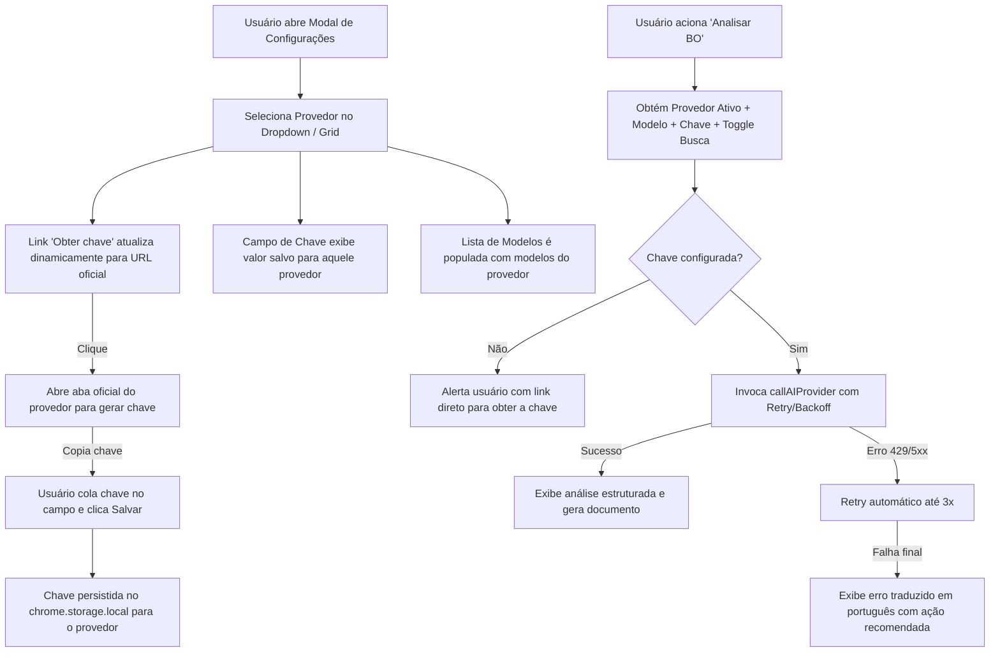

# PRD — Inserção de Multiprovedores de IA com Links para Obtenção de Chaves

**Documento de Requisitos de Produto (Product Requirements Document)**  
**Projeto:** EPROC Automatizado / SISP • Despacho IA  
**Versão:** 1.0  
**Status:** Aprovado para Desenvolvimento  
**Data:** 01 de Setembro de 2026  
**Autor:** Equipe de Engenharia e Produto

---

## 1. Visão Geral e Objetivos do Produto

### 1.1 Contexto
A extensão automatiza a análise e despacho de procedimentos e Boletins de Ocorrência (BOs). Atualmente, a integração com IA depende prioritariamente de um único provedor ou configuração rígida. Com a rápida evolução dos modelos de linguagem e a necessidade de alta disponibilidade, menor latência, limites de cota flexíveis e redução de custos, faz-se indispensável uma infraestrutura **multiprovedor** unificada, resiliente e de fácil configuração pelo usuário final.

### 1.2 Objetivos Principais
1. **Suporte a 8 Grandes Provedores de IA:** Google Gemini, OpenAI, Anthropic (Claude), Groq, OpenRouter, Mistral AI, Cohere e Cerebras.
2. **Experiência de Configuração Fluida (1-Click Key Access):** Disponibilizar links diretos e contextuais para a página exata de geração de API Key de cada provedor.
3. **Armazenamento Seguro e Individualizado:** Armazenar as chaves de forma independente por provedor no `chrome.storage.local`, garantindo isolamento e segurança local.
4. **Capacidade de Busca na Internet (Grounding):** Integrar pesquisa web em tempo real (ex: Google Search Grounding no Gemini e suportes equivalentes) ativável por toggle.
5. **Resiliência e Recuperação Automática:** Implementar sistema unificado de retry com backoff exponencial para tratar erros transitórios (429 Rate Limit, 5xx Server Error) e normalização de mensagens em português claro.
6. **Migração Transparente:** Migrar automaticamente configurações legadas (`apiKey` e `geminiModel`) sem interrupção do serviço para o usuário.

---

## 2. Provedores Suportados, Modelos e Links de Chave

| Provedor | Ícone | Modelos Principais Homologados | Link Direto para Obter Chave API | Características / Casos de Uso |
| :--- | :---: | :--- | :--- | :--- |
| **Google Gemini** | 🌐 | `gemini-2.5-flash`, `gemini-2.5-pro`, `gemini-3.5-flash`, `gemini-3.1-flash-lite`, `gemini-3.1-pro-preview`, `gemini-2.5-flash-lite` | [aistudio.google.com/apikey](https://aistudio.google.com/apikey) | Grounding nativo com Google Search, janela de contexto massiva, multimodal. |
| **OpenAI** | 🟢 | `gpt-4o`, `gpt-4o-mini`, `o3-mini`, `o1`, `gpt-4-turbo` | [platform.openai.com/api-keys](https://platform.openai.com/api-keys) | Alta precisão jurídica, raciocínio avançado com linha `o-series`. |
| **Anthropic (Claude)** | 🟣 | `claude-3-7-sonnet-20250219`, `claude-3-5-sonnet-20241022`, `claude-3-5-haiku-20241022`, `claude-3-opus-20240229` | [console.anthropic.com/settings/keys](https://console.anthropic.com/settings/keys) | Excelente aderência a instruções complexas, redação jurídica refinada. |
| **Groq** | ⚡ | `llama-3.3-70b-versatile`, `llama-3.1-8b-instant`, `mixtral-8x7b-32768` | [console.groq.com/keys](https://console.groq.com/keys) | Inferência ultrarrápida via LPUs, baixíssima latência para triagem em tempo real. |
| **OpenRouter** | 🔀 | `openrouter/auto`, `anthropic/claude-3.7-sonnet`, `openai/gpt-4o`, `meta-llama/llama-3.3-70b-instruct`, `google/gemini-2.5-flash` | [openrouter.ai/keys](https://openrouter.ai/keys) | Hub agregador com roteamento inteligente, fallback automático e múltiplos modelos. |
| **Mistral AI** | 🌪️ | `mistral-large-latest`, `mistral-small-latest`, `codestral-latest`, `open-mixtral-8x22b`, `ministral-8b-latest` | [console.mistral.ai/api-keys](https://console.mistral.ai/api-keys/) | Modelos europeus de alta performance, compactos e eficientes para tarefas analíticas. |
| **Cohere** | 🌊 | `command-r-plus-08-2024`, `command-r-08-2024`, `command-r7b-12-2024`, `command-light` | [dashboard.cohere.com/api-keys](https://dashboard.cohere.com/api-keys) | Especializado em RAG empresarial, sumarização estruturada e conformidade. |
| **Cerebras** | 🚀 | `llama3.3-70b`, `llama3.1-8b`, `llama-3.1-70b` | [cloud.cerebras.ai](https://cloud.cerebras.ai/) | Velocidade extrema de geração (~1500 tokens/segundo) via Wafer-Scale Engine. |

---

## 3. Requisitos Funcionais (RF)

### RF01 — Módulo Unificado de Provedores (`src/ai_providers.js`)
- Criar catálogo centralizado com metadados de cada provedor:
  - `id`, `name`, `icon`, `apiKeyUrl`, `baseUrl`, `defaultModel`, `models[]`, `authHeaderFormat`, `features` (ex: `supportsGrounding`).
- Implementar camada de abstração com interface comum:
  ```typescript
  callAIProvider({
    provider: string,
    model: string,
    apiKey: string,
    prompt: string,
    systemInstruction?: string,
    enableWebSearch?: boolean,
    temperature?: number,
    maxTokens?: number
  }): Promise<{ text: string, usage?: object, groundingMetadata?: object }>
  ```
- Suporte a endpoints específicos:
  - **Gemini:** REST v1beta (`generateContent`) com bloco `tools: [{ google_search: {} }]` quando a busca web estiver ativa.
  - **OpenAI, Groq, OpenRouter, Mistral, Cerebras:** Endpoint padrão `/v1/chat/completions` (ou `/chat/completions`) com payload `messages: [{ role: 'system', content }, { role: 'user', content }]` e `Bearer <key>`.
  - **Anthropic (Claude):** Endpoint `/v1/messages` com headers `x-api-key`, `anthropic-version: 2023-06-01` e `dangerously-allow-browser: true`.
  - **Cohere:** Endpoint `/v2/chat` com mensagens estruturadas e header `Authorization: Bearer <key>`.

### RF02 — Gestão de Erros, Retry e Backoff Exponencial
- Implementar algoritmo de retry automático para erros transitórios (códigos HTTP `429`, `500`, `502`, `503`, `504` ou falhas de rede fetch).
- Backoff exponencial com jitter: 3 tentativas com intervalos de 1s, 2s e 4s.
- Normalização de erros em português amigável com orientação de ação:
  - Erro `401/403`: *"Chave de API inválida ou sem permissão. Verifique sua chave no painel do provedor: [Link]"*
  - Erro `429`: *"Limite de requisições excedido (Rate Limit / Quota esgotada). Tente outro modelo/provedor ou aguarde alguns instantes."*
  - Erro `5xx`: *"Serviço do provedor temporariamente instável. Tentativas automáticas esgotadas."*

### RF03 — Interface de Usuário e Configurações no Popup
- **Header / Tela Principal:**
  - Badge compacto no topo exibindo o provedor e modelo ativos (ex: `🤖 Gemini 2.5 Flash 🌐` ou `🚀 Cerebras Llama 3.3 70B`).
- **Modal de Configurações (`#configModal`):**
  - **Seletor de Provedor:** Grid ou select estilizado com ícones representativos de cada um dos 8 provedores.
  - **Link Direto Dinâmico:** Botão/link `"Obter chave no [Nome do Provedor] ↗"` que atualiza dinamicamente conforme o provedor selecionado e abre a URL oficial em nova aba via `chrome.tabs.create` ou `target="_blank"`.
  - **Input de Chave de API Dinâmico:**
    - Campo de texto (tipo `password`) com botão de alternar visibilidade (ícone de olho).
    - Indicador de status visual se a chave para aquele provedor já está gravada.
    - Botão "Salvar Chave" individual por provedor.
  - **Seletor Inteligente de Modelos:**
    - Dropdown populado dinamicamente com base no provedor selecionado.
    - Modelos agrupados por categorias (ex: *Recomendados*, *Ultra-Rápidos*, *Raciocínio Avançado*, *Econômicos*).
  - **Toggle "🌐 Busca na Internet / Grounding":**
    - Interruptor elegante (switch) para habilitar/desabilitar pesquisa web em tempo real.
    - Desabilitado visualmente com tooltip explicativo caso o provedor selecionado não suporte grounding nativo.

### RF04 — Persistência e Migração de Dados
- Estrutura de armazenamento no `chrome.storage.local`:
  - `activeProvider`: Provedor atualmente selecionado (default: `"gemini"`).
  - `providerKeys`: Objeto `{ [providerId]: string }` contendo as chaves de API individualizadas.
  - `providerModels`: Objeto `{ [providerId]: string }` contendo o último modelo escolhido para cada provedor.
  - `enableWebSearch`: Booleano (default: `false`).
- **Rotina de Migração:**
  - Ao carregar a extensão, verificar se existem chaves legadas (`apiKey` e `geminiModel`).
  - Se `providerKeys.gemini` não existir e `apiKey` existir, migrar `providerKeys.gemini = apiKey`.
  - Se `providerModels.gemini` não existir e `geminiModel` existir, migrar `providerModels.gemini = geminiModel`.

---

## 4. Requisitos Não-Funcionais (RNF)

- **RNF01 — Segurança e Privacidade (Zero Third-Party Relays):** Todas as chamadas de API são feitas diretamente do cliente (browser extension) para o endpoint oficial de cada provedor, sem intermediários. Chaves nunca são enviadas para servidores externos não autorizados.
- **RNF02 — Performance e Responsividade:** A troca de provedor e modelo na interface deve ocorrer sem lag (< 50ms). A UI deve refletir o estado do storage instantaneamente.
- **RNF03 — Compatibilidade de Rede (Manifest V3):** Todas as origens de API devem estar explicitamente autorizadas em `host_permissions` no `manifest.json`.
- **RNF04 — Usabilidade Acessível:** Layout responsivo, tipografia legível, contraste adequado em modo escuro/claro e feedback visual imediato para ações (toasts de sucesso/erro).

---

## 5. Estrutura Detalhada das Mudanças no Código

### 5.1 `manifest.json` [MODIFY]
Adição dos hosts de API necessários em `host_permissions`:
```json
"host_permissions": [
  "*://*.ciasc.sc.gov.br/*",
  "*://*.ssp.sc.gov.br/*",
  "https://stsdwmaerbyfmgfcfgdv.supabase.co/*",
  "https://generativelanguage.googleapis.com/*",
  "https://api.openai.com/*",
  "https://api.anthropic.com/*",
  "https://api.groq.com/*",
  "https://openrouter.ai/*",
  "https://api.mistral.ai/*",
  "https://api.cohere.com/*",
  "https://api.cerebras.ai/*"
]
```

### 5.2 `src/ai_providers.js` [NEW]
- Definição do dicionário `AI_PROVIDERS_CONFIG`:
  - Configuração de cada provedor (Gemini, OpenAI, Anthropic, Groq, OpenRouter, Mistral, Cohere, Cerebras).
- Funções exportadas:
  - `getProviderConfig(providerId)`
  - `getAllProviders()`
  - `callAIProvider(options)`
  - `testProviderConnection(providerId, apiKey, model)`

### 5.3 `popup.html` [MODIFY]
- Inclusão do script `<script src="src/ai_providers.js"></script>` antes de `popup.js`.
- Atualização do cabeçalho com o badge do provedor/modelo ativo.
- Redesenho da seção de IA no modal de configurações para contemplar:
  - Select/Grid de Provedores.
  - Link dinâmico com ID `#providerKeyHelpLink` ("Obter chave no [Provedor] ↗").
  - Campo de API Key com botão "Mostrar/Ocultar" e botão "Salvar Chave".
  - Select de Modelos dinâmico `#modelSelect`.
  - Toggle switch `#toggleWebSearch` com label explicativa.

### 5.4 `src/popup.js` / `popup.js` [MODIFY]
- Inicialização e leitura de `activeProvider`, `providerKeys`, `providerModels`, `enableWebSearch`.
- Execução da rotina de migração de chaves legadas.
- Listeners para:
  - Troca de provedor: atualiza link de obtenção de chave, input de chave correspondente e lista de modelos.
  - Salvar chave: persiste no `providerKeys[providerId]`.
  - Troca de modelo: persiste no `providerModels[providerId]`.
  - Alternância do toggle de busca na web.
- Integração da chamada de análise de BO (`analisarProcesso` / `executarAnalise`) com a função `callAIProvider`.

---

## 6. Fluxos de Interação do Usuário



---

## 7. Plano de Verificação e Critérios de Aceite (QA)

### 7.1 Testes Funcionais Manuais

| ID | Cenário de Teste | Procedimento | Resultado Esperado |
| :---: | :--- | :--- | :--- |
| **TC01** | **Links Oficiais de Chave** | Clicar em "Obter chave" para cada um dos 8 provedores. | Cada link deve abrir exatamente a URL oficial especificada (ex: AI Studio, OpenAI Platform, Anthropic Console, Groq Console, etc.) em nova aba. |
| **TC02** | **Troca Dinâmica de Provedor** | Alternar sucessivamente entre os 8 provedores. | O input de chave, link de ajuda, e lista de modelos mudam instantaneamente de acordo com o provedor selecionado. |
| **TC03** | **Persistência Individualizada** | Inserir chaves distintas para 3 provedores diferentes (ex: Gemini, Groq, OpenAI), salvar e reabrir o popup. | Cada provedor mantém sua respectiva chave e modelo selecionado sem sobreposição. |
| **TC04** | **Migração de Chave Legada** | Simular storage antigo com `{ apiKey: "AIzaSy...", geminiModel: "gemini-2.5-flash" }`. | A extensão migra para `providerKeys.gemini` e `providerModels.gemini` mantendo funcionamento imediato. |
| **TC05** | **Execução de Análise de BO** | Executar análise com Gemini, OpenAI, Claude, Groq e Cerebras. | A análise é concluída com sucesso, retornando os blocos estruturados e viabilizando o despacho. |
| **TC06** | **Busca na Internet (Grounding)** | Habilitar toggle "Busca na Internet" no Gemini e analisar BO com termos recentes. | Requisição inclui o bloco `google_search` no payload e a resposta reflete grounding. |
| **TC07** | **Tratamento de Chave Inválida** | Informar uma chave propositalmente incorreta. | Exibição de mensagem amigável em português com link de suporte à chave, sem crash na extensão. |
| **TC08** | **Retry em Rate Limit (429)** | Simular retorno 429 da API. | Extensão executa até 3 tentativas com backoff antes de acusar esgotamento de cota. |

---

## 8. Definição de Pronto (Definition of Done — DoD)

- [x] PRD documentado e homologado.
- [ ] `manifest.json` atualizado com todas as permissões de rede dos 8 provedores.
- [ ] `src/ai_providers.js` implementado com todos os 8 provedores, tratamento de payloads, endpoints, grounding e backoff.
- [ ] Interface gráfica (`popup.html` e `popup.css`) atualizada com links dinâmicos, seletor de provedores, badge e switch de busca na web.
- [ ] Lógica de controle (`popup.js`) integrada com persistência individual e migração de chaves legadas.
- [ ] Bateria de testes de QA executada com 100% de sucesso nos critérios de aceite.
